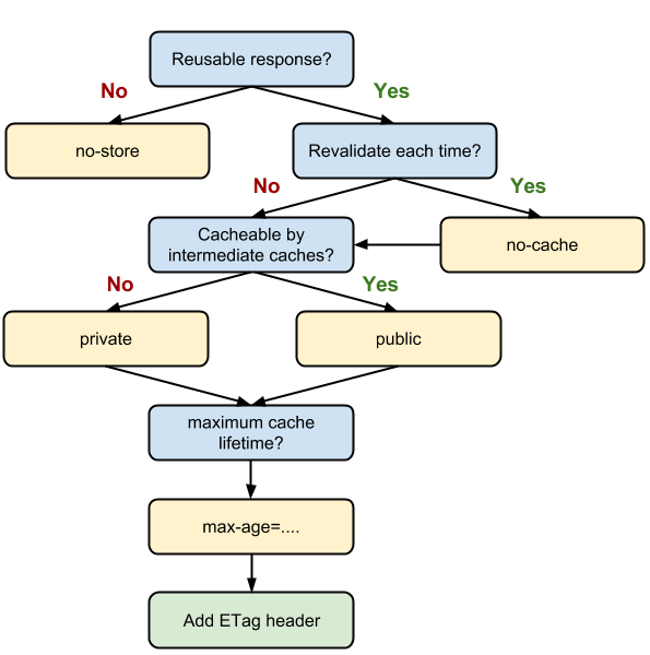

# README related with Cache

## Background

Sometimes application cache content from Object Storage (Dekabox). 
This is normal behaviour but sometimes this cause a lot of trouble since this can be unwanted situation or scenario for developer.

## Cache mechanism in browser

There are 3 (three) parameters to check or detech cache in web server or browser:

- Cache Control : The server can return a Cache-Control directive to specify how, and for how long, the browser and other intermediate caches should cache the individual response

- E-tag : When the browser finds an expired cached response, it can send a small token (usually a hash of the file's contents) to the server to check if the file has changed. If the server returns the same token, then the file is the same, and there's no need to re-download it.

- Last-modified : This header serves the same purpose as ETag, but uses a time-based strategy to determine if a resource has changed, as opposed to the content-based strategy of ETag.

## How cache-control works



## How to prevent from Web Server

Following is the howto from each web server

- [Express](https://expressjs.com/en/api.html#express.static)
- [Apache](https://httpd.apache.org/docs/2.4/caching.html)
- [nginx](http://nginx.org/en/docs/http/ngx_http_headers_module.html)
- [Firebase](https://firebase.google.com/docs/hosting/full-config)
- [Netlify](https://www.netlify.com/blog/2017/02/23/better-living-through-caching/)


## How to prevent from Application (cache-control)

- Set no cache in cache-control

```
Cache-Control: no-cache
```

- Set dont save object into cache

```
Cache-Control: no-store
```

- Or if you have to cache, set it for a very long time

```
Cache-Control: max-age=31536000
```


### Resources

- [dev.to explained cache](https://web.dev/http-cache/)
- [dev.to love your cache](https://web.dev/love-your-cache/)
- [cache best practice](https://jakearchibald.com/2016/caching-best-practices/)